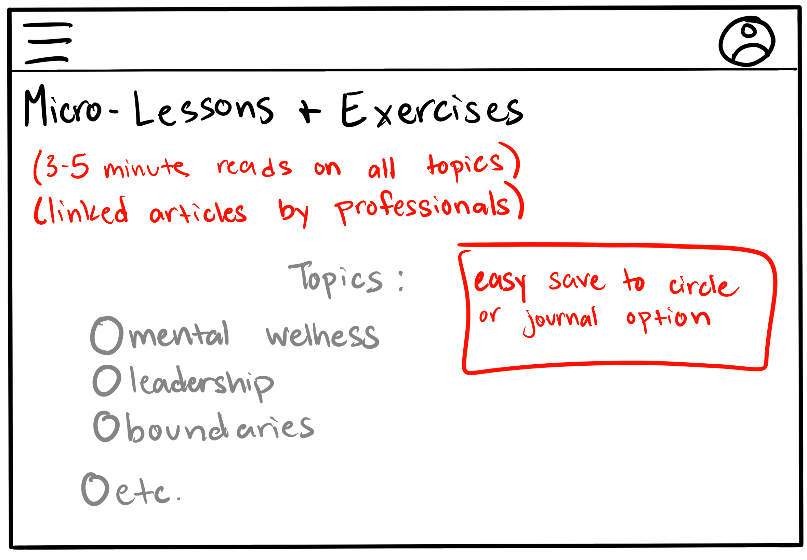
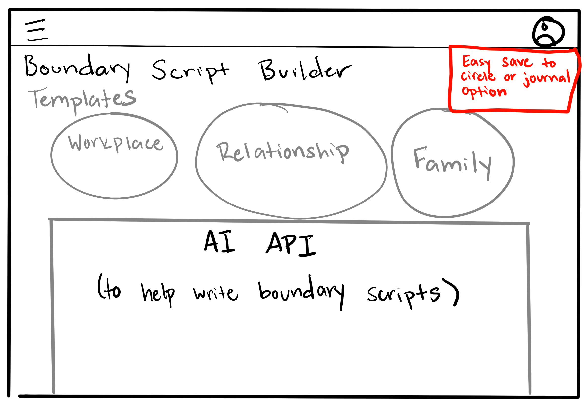
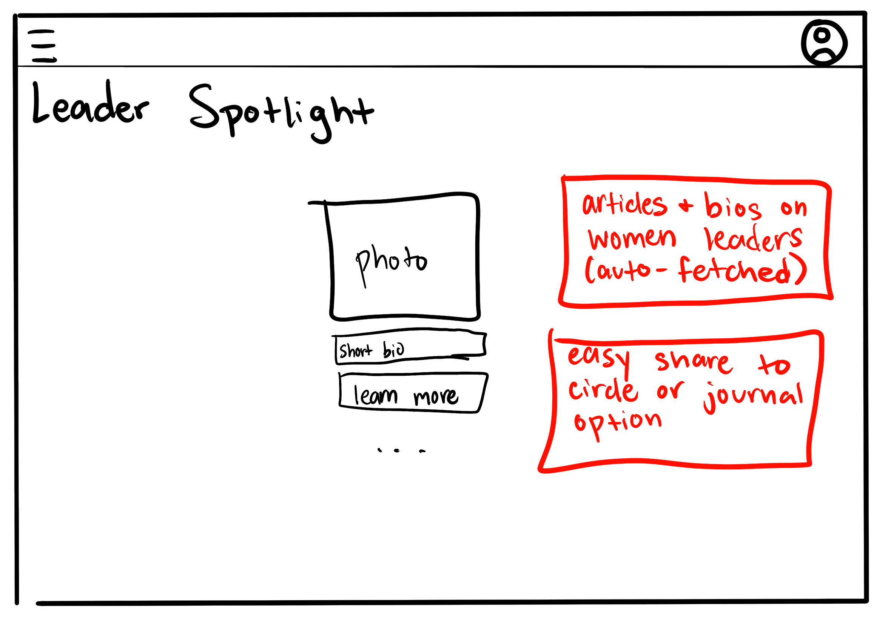
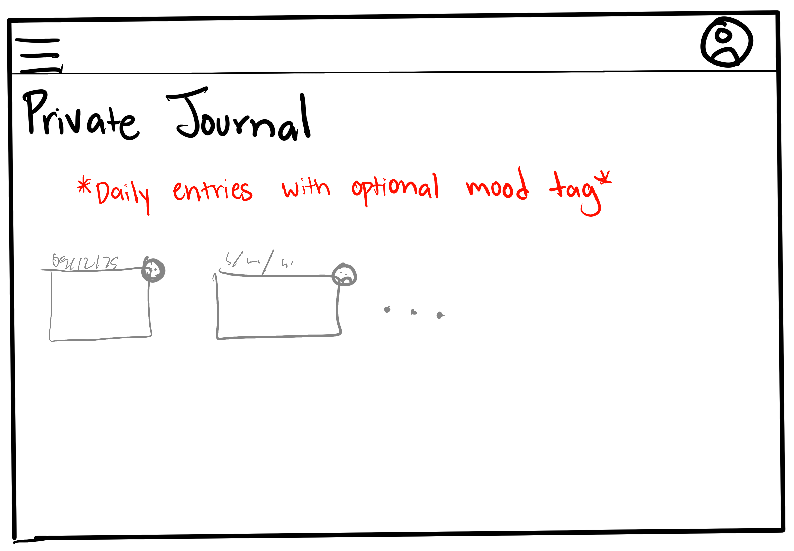
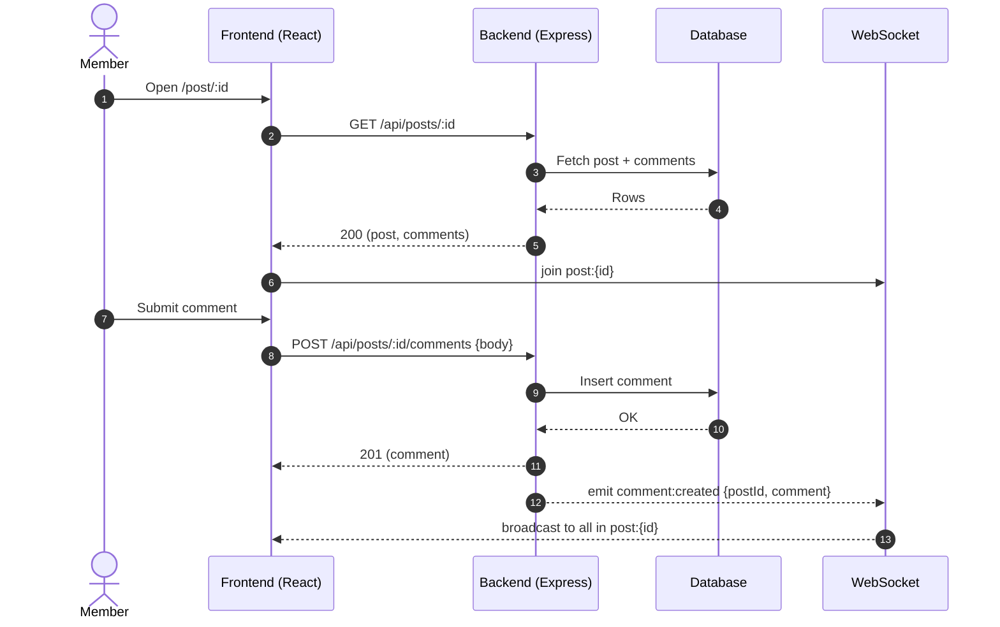
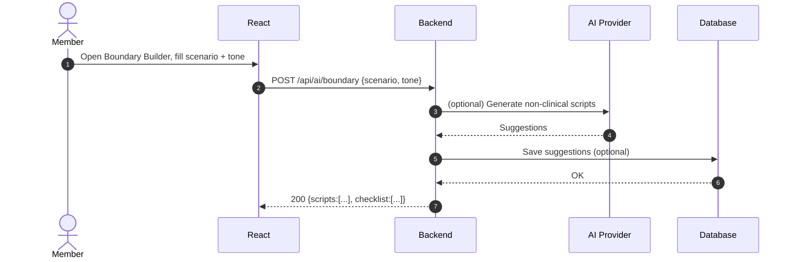
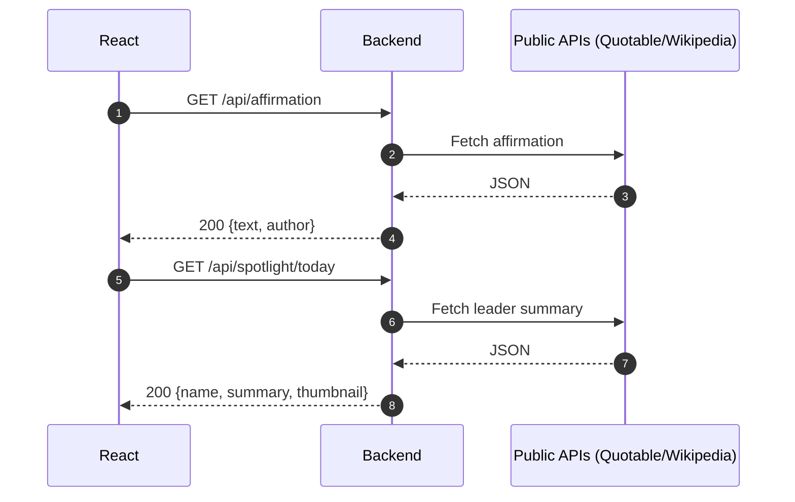
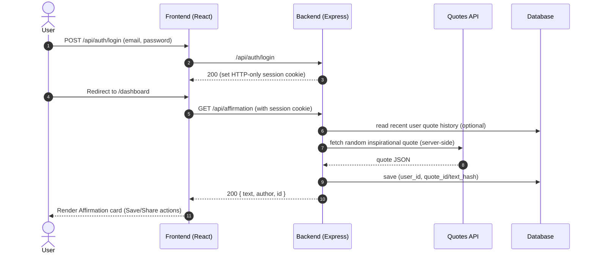

# EmpowerHer
A platform for teen girls and young women to learn how to lead with confidence.

## 🚀 Specification Deliverable

For this deliverable I did the following. I checked the box `[x]` and added a description for things I completed.

- [x] Proper use of Markdown
- [x] A concise and compelling elevator pitch
- [x] Description of key features
- [x] Description of how you will use each technology
- [x] One or more rough sketches of your application. Images must be embedded in this file using Markdown image references.

### Elevator pitch

EmpowerHer is a supportive website for teen girls and young women to learn about safety, boundaries, leadership, confidence, and mental wellness. Members read bite-size lessons, share real experiences in topic circles, and encourage each other with kind, constructive comments. Optional AI helps draft respectful boundary scripts and confidence prompts, while curated resources keep crisis help one click away. It’s a gentle, private, and uplifting space — education first, community always.

### Design

#### Home Design

#### Topic Circles

#### Micro-Lessons & Exercises

#### Boundary Script Builder

#### Leader Spotlight

#### Private Journnal

### Key features

- **Topic Circles**: (Leadership, Confidence, Safety, Wellness) Post questions or experiences with optional pseudonym; threaded comments. Supportive discussions with clear community guidelines.
- **Boundary Script Builder**: Templates give suggested scripts for different situations, such as relationships, the workplace, and family. Optional AI refines wording.
- **Micro-Lessons & Exercises**: 3-5 minute reads (e.g., "How to say no," "Grounding 5-4-3-2-1").
- **Affirmations & Leader Spotlight**: Daily encouragement and short bios of women leaders (auto-fetched). Share to circle or save to private journal with one click.
- **Private Journal**: Personal reflections, optional mood tag; entries visible only to the user
- **Community Safety**: Pseudonyms for sensitive posts, reporting, auto-hide at threshold, moderator queue, kind-language nudges before posting.

### Technologies

I am going to use the required technologies in the following ways.

**HTML**
- Single index.html (React SPA), semantic structure (header/nav/main/footer), accessible forms and labels, meta/OG tags

**CSS** 
- Desktop-first Grid/Flex; responsive breakpoints; WCAG-AA contrast; visible focus rings; prefers-reduces-motion respected.
- Subtle animations on card hover, comment appear, and checklist completion.

**React** 
- Routes: /, /login, /register, /circles/:id, /post/:id, /lessons, /journal, /profile, /admin
- Components: Navbar, CircleList, PostCard, PostDetail, CommentList, BoundaryBuilder, AffirmationCard, LeaderSpotlightCard, LessonCard, JournalEditor, ReportButton, AdminQueue
- State: Auth context (protected routes), optimistic comment posting, realtime updates via WebSocket (new comments/edits/auto-hide)

**Service** 
- Auth
- Circles/Posts/Comments
- Lessons/Journal
- Admin
- 3rd-party proxy endpoints (meets course "public API")
- Boundary Builder (AI optional)

**DB/Login** 
- Postgres, MySQL, or MongoDB
- Schema
- Indexes

**WebSocket**
- Rooms: post:{postId}, circle:{circleId}
- Server → client events:
- comment:created {postId, comment}
- comment:hidden {postId, commentId}
- post:created {circleId, post}
- presence:update {room, count} (optional; shows “12 viewing”), Client subscribes on page mount; unsubscribes on leave.

## 🚀 AWS deliverable

For this deliverable I did the following. I checked the box `[x]` and added a description for things I completed.

- [x] **Server deployed and accessible with custom domain name** - [My server link](https://empowerher.click).

## 🚀 HTML deliverable

For this deliverable I did the following. I checked the box `[x]` and added a description for things I completed.

- [x] **HTML pages** - I created five pages (index.html, resources.html, topic_circles.html, login.html, and about.html) to represent the five main components of my startup.
- [x] **Proper HTML element usage** - Each page includes HEADER, NAV, MAIN, and FOOTER tags to structure the content.
- [x] **Links** - The shared navigation links connect between all pages.
- [x] **Text** - I added brief, specific text on each page explaining its purpose (Helplines, articles, login, circles, etc.)
- [x] **3rd party API placeholder** - I included an article/resource section that calls a public API as a placeholder.
- [x] **Images** - I added a placeholder image as the logo.
- [x] **Login placeholder** - I added a simple login form that saves and displays the users' name.
- [x] **DB data placeholder** - The resources page will render a list of articles.
- [x] **WebSocket placeholder** - The topic circles page shows simulated realtime data wher WebSocket updates will appear.

## 🚀 CSS deliverable

For this deliverable I did the following. I checked the box `[x]` and added a description for things I completed.

- [ ] **Header, footer, and main content body** - I did not complete this part of the deliverable.
- [ ] **Navigation elements** - I did not complete this part of the deliverable.
- [ ] **Responsive to window resizing** - I did not complete this part of the deliverable.
- [ ] **Application elements** - I did not complete this part of the deliverable.
- [ ] **Application text content** - I did not complete this part of the deliverable.
- [ ] **Application images** - I did not complete this part of the deliverable.

## 🚀 React part 1: Routing deliverable

For this deliverable I did the following. I checked the box `[x]` and added a description for things I completed.

- [ ] **Bundled using Vite** - I did not complete this part of the deliverable.
- [ ] **Components** - I did not complete this part of the deliverable.
- [ ] **Router** - I did not complete this part of the deliverable.

## 🚀 React part 2: Reactivity deliverable

For this deliverable I did the following. I checked the box `[x]` and added a description for things I completed.

- [ ] **All functionality implemented or mocked out** - I did not complete this part of the deliverable.
- [ ] **Hooks** - I did not complete this part of the deliverable.

## 🚀 Service deliverable

For this deliverable I did the following. I checked the box `[x]` and added a description for things I completed.

- [ ] **Node.js/Express HTTP service** - I did not complete this part of the deliverable.
- [ ] **Static middleware for frontend** - I did not complete this part of the deliverable.
- [ ] **Calls to third party endpoints** - I did not complete this part of the deliverable.
- [ ] **Backend service endpoints** - I did not complete this part of the deliverable.
- [ ] **Frontend calls service endpoints** - I did not complete this part of the deliverable.
- [ ] **Supports registration, login, logout, and restricted endpoint** - I did not complete this part of the deliverable.

## 🚀 DB deliverable

For this deliverable I did the following. I checked the box `[x]` and added a description for things I completed.

- [ ] **Stores data in MongoDB** - I did not complete this part of the deliverable.
- [ ] **Stores credentials in MongoDB** - I did not complete this part of the deliverable.

## 🚀 WebSocket deliverable

For this deliverable I did the following. I checked the box `[x]` and added a description for things I completed.

- [ ] **Backend listens for WebSocket connection** - I did not complete this part of the deliverable.
- [ ] **Frontend makes WebSocket connection** - I did not complete this part of the deliverable.
- [ ] **Data sent over WebSocket connection** - I did not complete this part of the deliverable.
- [ ] **WebSocket data displayed** - I did not complete this part of the deliverable.
- [ ] **Application is fully functional** - I did not complete this part of the deliverable.
