# EmpowerHer
A platform for teen girls and young women to learn how to lead with confidence.

## 🚀 Specification Deliverable

For this deliverable I did the following. I checked the box `[x]` and added a description for things I completed.

- [x] Proper use of Markdown
- [x] A concise and compelling elevator pitch
- [x] Description of key features
- [x] Description of how you will use each technology
- [x] One or more rough sketches of your application. Images must be embedded in this file using Markdown image references.

### Elevator pitch

EmpowerHer is a supportive website for teen girls and young women to learn about safety, boundaries, leadership, confidence, and mental wellness. Members read bite-size lessons, share real experiences in topic circles, and encourage each other with kind, constructive comments. Optional AI helps draft respectful boundary scripts and confidence prompts, while curated resources keep crisis help one click away. It’s a gentle, private, and uplifting space — education first, community always.

### Design

#### Home Design

#### Topic Circles

#### 

#### About Us

```mermaid
sequenceDiagram
    autonumber
    actor U as User (Voter on Web)
    participant FE as Frontend (React SPA)
    participant API as Backend API (Express)
    participant DB as Database
    participant WS as WebSocket Server

    U->>FE: Navigate to /post/:id in browser
    FE->>API: GET /api/posts/:postId (details + responses + my votes)
    API->>DB: Query post/responses/tallies/myVotes
    DB-->>API: Rows
    API-->>FE: 200 (post, responses, tallies, myVotes)

    U->>FE: Drag & drop (or keyboard move) to rank top 3
    FE->>API: POST /api/votes {postId, rankings:[r1,r2,r3]}
    API->>DB: Upsert votes (rank=1..3) for user/post
    DB-->>API: OK
    API-->>FE: 200 (myVotes, new tallies)
    API-->>WS: emit('tally:updated', {postId, tallies})

    WS-->>FE: tally:updated (to all viewers of this post)
    FE-->>U: Live tally updates without reload

    U->>FE: Click "Lock in"
    FE->>API: POST /api/votes/finalize {postId}
    API->>DB: Mark user’s vote finalized
    DB-->>API: OK
    API-->>FE: 200 (finalized:true)
    API-->>WS: emit('vote:finalized', {postId, userId})

```

### Key features

- **Secure authentication over HTTPS**: register, login, logout
- **Create style questions with images**: upload one or more images of clothing items and ask: "How would you style this?"
- **Community responses with images**: respondents can upload inspo photos or outfit mockups with comments on how to style clothing items
- **Ranked voting (top 3)**: the top three comments/responses with the most votes will be highlighted
- **Realtime tallies**: as votes come in, everyone sees tallies update instantly (WebSocket)
- **AI style and beauty advice**: optional AI suggestions
- **Show the final look**: creator posts final outfit in response to their question
- **Admin tools**: create/close/delete questions, moderate content, ban abuse
- **Persistent results**: posts, responses, votes and AI suggestions are stored and queryable

### Technologies

I am going to use the required technologies in the following ways.

**HTML**
- Single HTML entry (index.html) for a React SPA (desktop-first layout; also responsive down to tablet/phone)
- Semantic structure for header, nav, main, footer, accessible forms and labels
- Web meta: viewport, Open Graph, and favicon to API/CDN

**CSS** 
- Desktop-first CSS Grid/Flex layout; breakouts for tablet/phone
- Design tokens for color/spacing/typography; high contrast for readability
- Hover/focus/active states; visible focus rings
- Image handling: responsive max-width: 100%, object-fit, and a simple lightbox on desktop

**React** 
- Stack: React + react-router-dom
- Routes: / (feed), /login, /register, /create, /post/:id, /profile, /admin
- Components: Navbar, AuthForm, PostCard, PostDetail, ResponseCard, Top3Picker (HTML5 DnD + keyboard), TallyPanel, Uploader, AiAdvicePanel, AdminDashboard
- Perf: code-split heavy views with React.lazy; prefetch data on hover for desktop
- A11y: Proper ARIA for lists/cards, drag handles, live region updates on tally changes

**Service** 
- Stack
- Security for browsers
- Auth
- Uploads
- Posts/Responses
- Voting
- AI and public API: calls AI provider server-side and returns normalized tips

**DB/Login** 
- Postgres, MySQL, or MongoDB
- Schema
- Indexes
- Tallies: compute on read or cache weighted scores

**WebSocket**
- Room per post: post:{postID}
- Client subscribes when mounts, cleans up on unmount

## 🚀 AWS deliverable

For this deliverable I did the following. I checked the box `[x]` and added a description for things I completed.

- [ ] **Server deployed and accessible with custom domain name** - [My server link](https://yourdomainnamehere.click).

## 🚀 HTML deliverable

For this deliverable I did the following. I checked the box `[x]` and added a description for things I completed.

- [ ] **HTML pages** - I did not complete this part of the deliverable.
- [ ] **Proper HTML element usage** - I did not complete this part of the deliverable.
- [ ] **Links** - I did not complete this part of the deliverable.
- [ ] **Text** - I did not complete this part of the deliverable.
- [ ] **3rd party API placeholder** - I did not complete this part of the deliverable.
- [ ] **Images** - I did not complete this part of the deliverable.
- [ ] **Login placeholder** - I did not complete this part of the deliverable.
- [ ] **DB data placeholder** - I did not complete this part of the deliverable.
- [ ] **WebSocket placeholder** - I did not complete this part of the deliverable.

## 🚀 CSS deliverable

For this deliverable I did the following. I checked the box `[x]` and added a description for things I completed.

- [ ] **Header, footer, and main content body** - I did not complete this part of the deliverable.
- [ ] **Navigation elements** - I did not complete this part of the deliverable.
- [ ] **Responsive to window resizing** - I did not complete this part of the deliverable.
- [ ] **Application elements** - I did not complete this part of the deliverable.
- [ ] **Application text content** - I did not complete this part of the deliverable.
- [ ] **Application images** - I did not complete this part of the deliverable.

## 🚀 React part 1: Routing deliverable

For this deliverable I did the following. I checked the box `[x]` and added a description for things I completed.

- [ ] **Bundled using Vite** - I did not complete this part of the deliverable.
- [ ] **Components** - I did not complete this part of the deliverable.
- [ ] **Router** - I did not complete this part of the deliverable.

## 🚀 React part 2: Reactivity deliverable

For this deliverable I did the following. I checked the box `[x]` and added a description for things I completed.

- [ ] **All functionality implemented or mocked out** - I did not complete this part of the deliverable.
- [ ] **Hooks** - I did not complete this part of the deliverable.

## 🚀 Service deliverable

For this deliverable I did the following. I checked the box `[x]` and added a description for things I completed.

- [ ] **Node.js/Express HTTP service** - I did not complete this part of the deliverable.
- [ ] **Static middleware for frontend** - I did not complete this part of the deliverable.
- [ ] **Calls to third party endpoints** - I did not complete this part of the deliverable.
- [ ] **Backend service endpoints** - I did not complete this part of the deliverable.
- [ ] **Frontend calls service endpoints** - I did not complete this part of the deliverable.
- [ ] **Supports registration, login, logout, and restricted endpoint** - I did not complete this part of the deliverable.

## 🚀 DB deliverable

For this deliverable I did the following. I checked the box `[x]` and added a description for things I completed.

- [ ] **Stores data in MongoDB** - I did not complete this part of the deliverable.
- [ ] **Stores credentials in MongoDB** - I did not complete this part of the deliverable.

## 🚀 WebSocket deliverable

For this deliverable I did the following. I checked the box `[x]` and added a description for things I completed.

- [ ] **Backend listens for WebSocket connection** - I did not complete this part of the deliverable.
- [ ] **Frontend makes WebSocket connection** - I did not complete this part of the deliverable.
- [ ] **Data sent over WebSocket connection** - I did not complete this part of the deliverable.
- [ ] **WebSocket data displayed** - I did not complete this part of the deliverable.
- [ ] **Application is fully functional** - I did not complete this part of the deliverable.
